# Wordle Battle 

## Installation Manual

### Prerequisites
To be able to run the game locally, you will need the following:
* Android Studio
* Android SDK

### Game Installation
To install the game, do the following steps:
1. Clone this Github repository in a folder on your computer. The easiest way to clone it is through writing the following command on the command line: `git clone https://github.com/JoakimAustvold/WordleBattle.git`. Make sure Git is installed on your computer. If you do not have Git, you can download the ZIP-file by clicking on the *Download ZIP* option for this Github repository.
2. Make sure Android Studio is installed on your computer.
3. Open Android Studio and click *Open*. 
4. Navigate to the folder where you cloned the project. It is important that you select the *build.gradle*-file, as shown in the image below. This ensures that the build is initiated and the application can run as expected. Click *OK*.

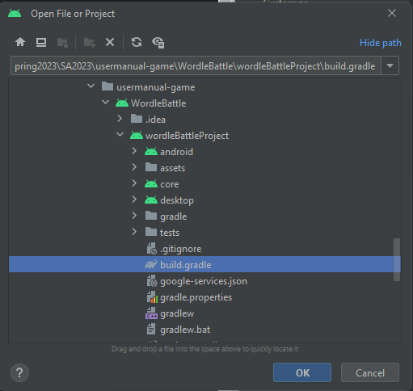

5. You might get a question about whether you trust the authors of the project. To proceed, click on *Trust project*.
6. The project code should now be available in Android Studio. Using Android Studio's built-in emulator, you can play the game. We advise you to use the emulator Pixel Pro 6 for the best experience, as this is the emulator we mostly used when designing the UI.  

## Game Manual

### Playing Singleplayer
When starting the application, you will first be presented with the main menu, as you can see in the picture below. Press the *Singleplayer* button to start a new singleplayer game.

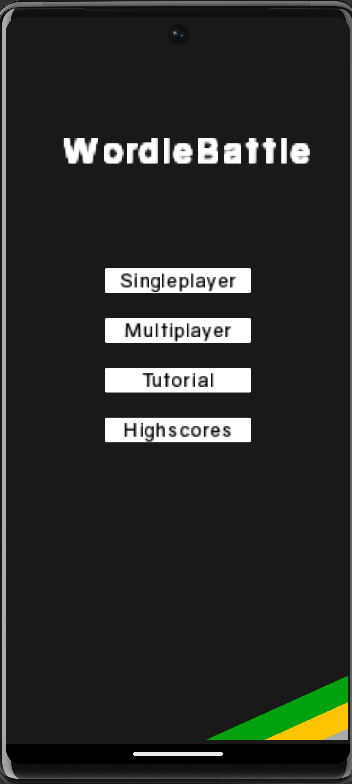

If this is your first time playing the game, you will be presented with a tutorial-screen showing the rules of the game. This view is shown in picture below. Press the *Back* button to continue.

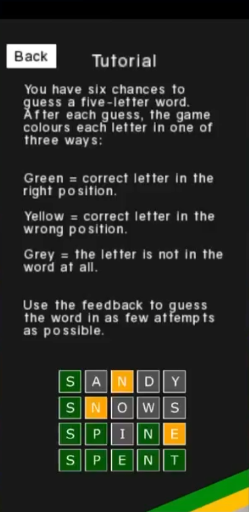

Now you have successfully started a new singleplayer game! Guess the correct 5-letter word within six tries. As the picture below shows, your guesses will appear at the top of the screen, showing which letters of your guessed word might be part of the solution. Each letter will be coloured based on how close you are to the solution. As the tutorial indicates: green = correct letter and correct position, yellow = correct letter, but wrong position, grey = letter is not in the word at all.

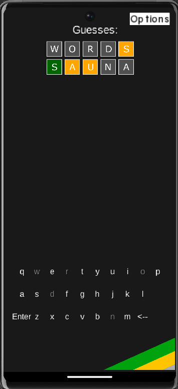

Whenever you complete the game by guessing correctly, you have the option to submit your score to the leaderboard. To do this, enter your name in the prompt shown in below and press the *Submit* button. The score should now be uploaded to the leaderboard. After this, you will be automatically taken to a new game. If you wish to start a new game without submitting your highscore, press *New Game* instead.

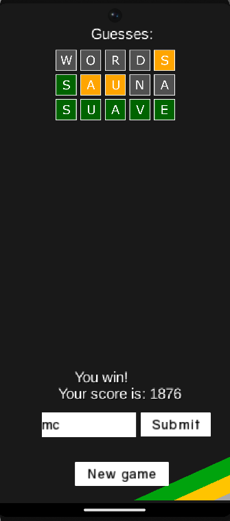

### Highscores 

To view the leaderboard of submitted highscores, go to the main menu and press the *Highscores* button. You will be presented with a scrollable list of highscores as shown below. 

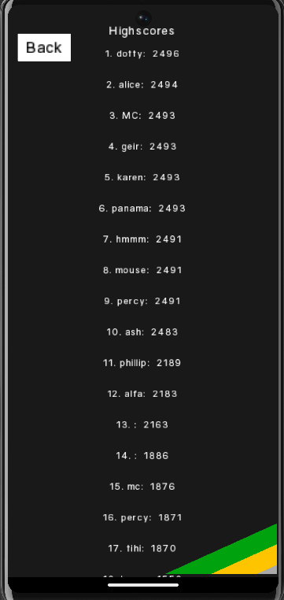

### Settings Menu

A settings menu is available in the top left corner at any time when in-game. Press this button to open the menu.
From this page, you can continue the game, view the tutorial again, restart the game with a new word, or go back to the main menu.

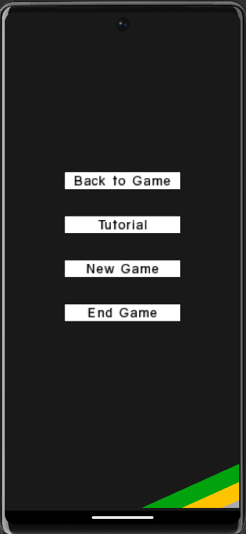

### Playing Multiplayer

To start a new multiplayer game, press the *Multiplayer* button in the main menu. To host a new game, press the *Host Game* button. You will be prompted to enter a name representing you, the player. Press the enter button. You will be presented with a lobby-view that shows your player name and a room code, as shown in the picture below. Send this code to a friend and wait for them to join the lobby!

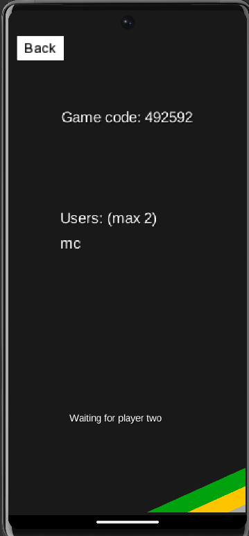

To join another player's lobby, press the *Multiplayer* button in the main menu, then press the *Join Game* button. You will then be prompted to enter the game code you received from another player, the host, in addition to your name. Click *Join Lobby* to continue. 

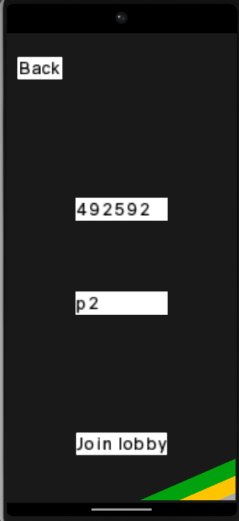

You should now be in the lobby with the other player, as shown in the picture below. When the host starts the game, you will be presented with the next screen.

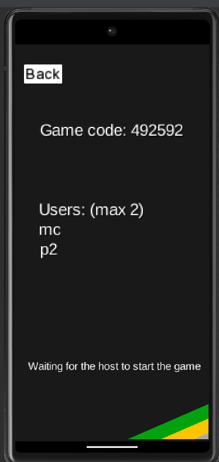

When a game is started, both players are presented with a screen prompting to input a five-letter word. When each player has entered a valid five-letter word, a Wordle game starts where the player should try to guess the opponents word. The in-game screen and screen that is shown upon completion of the game is displayed below (note that this is not an in-game capture):

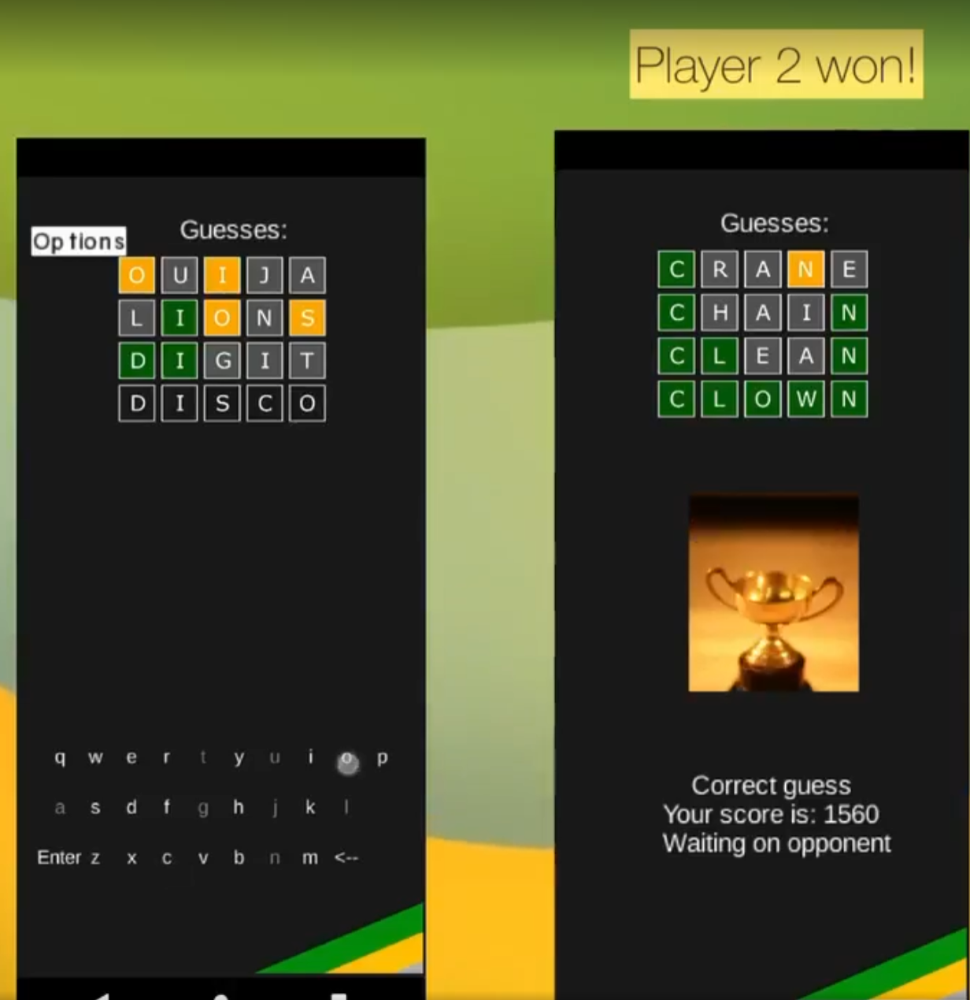

